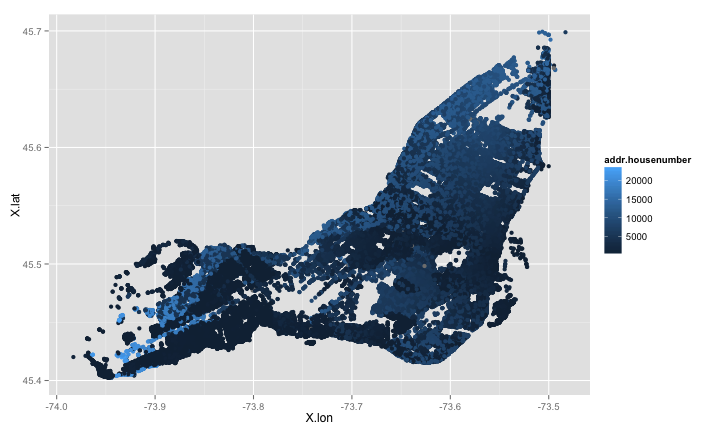

House Numbers on the Island of Montreal
========================================================
by [Nicolas Kruchten](http://nicolas.kruchten.com)
--------------------------------------------------------

### Final Output

This is what we'll be making:


### Step 1: Get the Data

We'll use the [Overpass API](http://wiki.openstreetmap.org/wiki/Overpass_API) to query [OpenStreetMap](http://www.openstreetmap.org/) data: we want "nodes" (basically points) within the Island of Montreal which have a non-empty `addr:housenumber` tag, and we want the output in CSV format so that R can read it smoothly. Here's an [Overpass QL](http://wiki.openstreetmap.org/wiki/Overpass_API/Overpass_QL) query that gives us just that:


```r
query = paste(
  '[out:csv(::lat, ::lon, "addr:housenumber")];',
  'area ["name"="Montréal (06)"]->.a;',
  'out body qt;',
  '(node(area.a)["addr:housenumber"~"."];);',
  'out body;'
)
```

Let's actually run this query on a public Overpass endpoint and shoehorn the output into a data frame which `ggplot2` will understand:


```r
overpassURI = 'http://overpass-api.de/api/interpreter'
queryURI = paste(overpassURI, '?data=', URLencode(query), sep='')
mtl <- read.delim(url(queryURI), stringsAsFactors = FALSE)
mtl$addr.housenumber = as.numeric(mtl$addr.housenumber)
```

```
## Warning: NAs introduced by coercion
```

```r
mtl = mtl[sample.int(nrow(mtl)),]
head(mtl)
```

```
##          X.lat     X.lon addr.housenumber
## 72162 45.49771 -73.83123              139
## 67918 45.43958 -73.89345               59
## 24608 45.52074 -73.56383             1124
## 86231 45.49366 -73.69993             7000
## 69319 45.46517 -73.87465            17099
## 87376 45.48182 -73.62779             4901
```

### Step 2: Make the Graphic

With the data just so, making the basic plot is a straightforward `ggplot2` call to map lon/lat to x/y and housenumber to colour:


```r
library(ggplot2)
plot = qplot(data=mtl, x=X.lon, y=X.lat, color=addr.housenumber)
plot
```

 

### Step 3: Tweak the Graphic

We will dress it up a bit before publication, though, to shake that "defaults" look. We'll use a colour scale that makes things pop and make a nice legend for it which we'll move into the empty part of the chart area (where Laval should be!), and then we'll get rid of all unnecessary elements like the panel, gridlines and x and y axis labels, and we'll save the result as a high resolution PNG:


```r
png(filename="housenumbers.png", height=1500, width=2000, units="px")
plot +
  geom_jitter(
    position = position_jitter(width=0.002, height=0.002),
    alpha=0.5
  ) +
  scale_colour_gradientn(
    colours = rainbow(7), trans='log10', name = expression(atop(
      "House Numbers on the Island of Montreal",
      atop(italic("using data from OpenStreetMap"), "")
    )),
    breaks=c(1, 10, 100, 1000, 10000),
    guide = guide_colourbar(
      title.position="top", direction = "horizontal",
      title.hjust = 0.5,
      ticks = FALSE, barwidth = 55, barheight = 0.8)
  ) +
  scale_x_continuous(breaks = NULL, name= "") +
  scale_y_continuous(breaks = NULL, name= "") + 
  theme(
    legend.position = c(.35, .75), 
    legend.title = element_text(size=40),
    legend.text = element_text(size=20),
    text=element_text(family="Georgia"),
    panel.background = element_blank()
  )
dev.off()
```

```
## quartz_off_screen 
##                 2
```

And here's the final output again:


